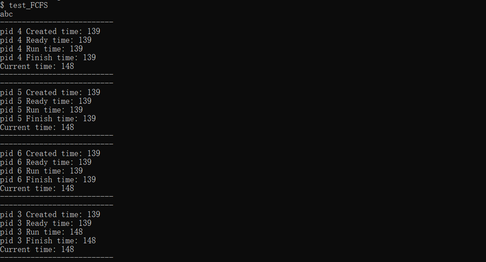
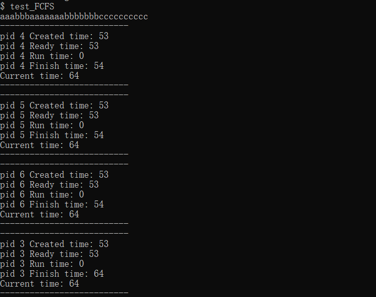
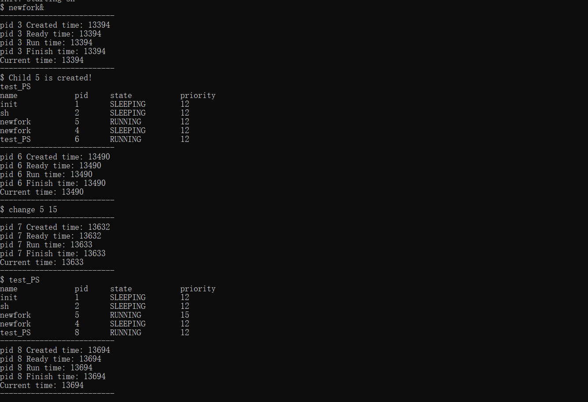
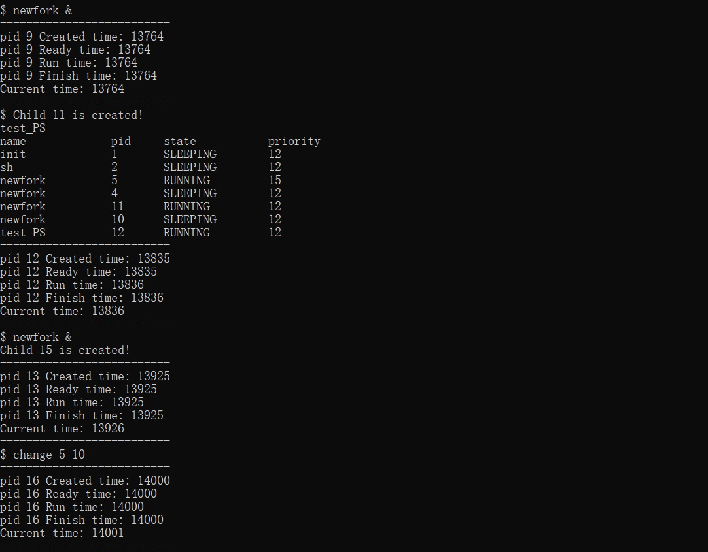
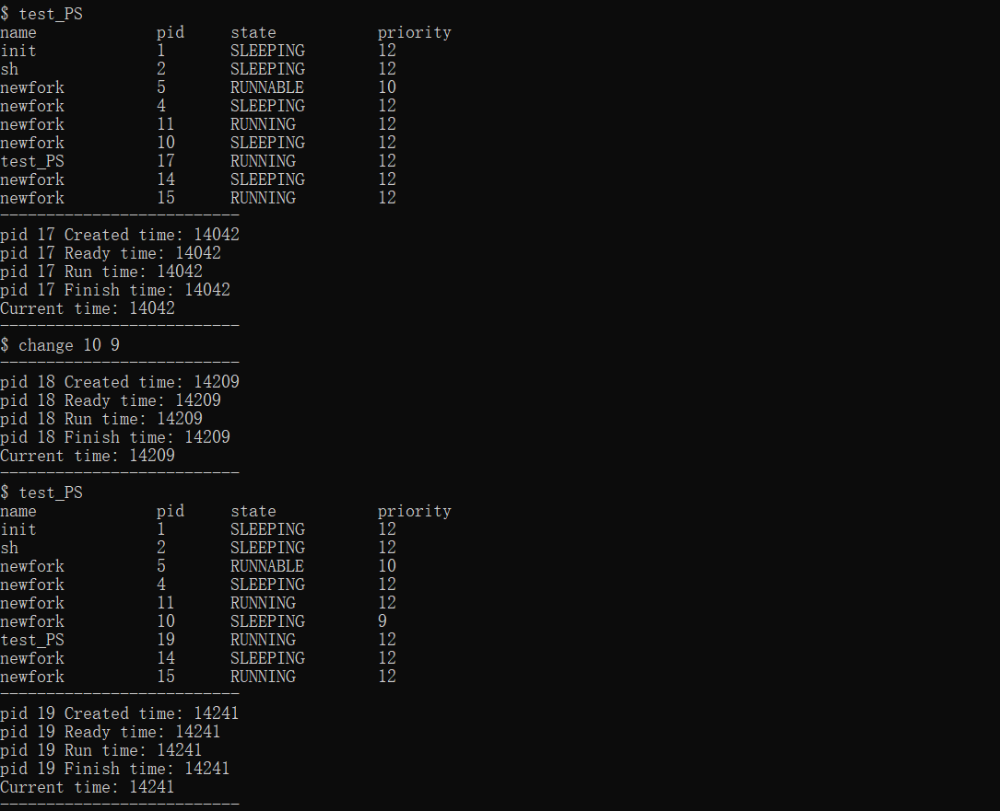

# 进程调度：

#### 1.准备工作：

#### 1.1

首先修改一些已经实现的系统函数，为了可以使进程的调度更加清楚：

##### `proc.h`：

在proc中增加

```c++
  int create_time;             //进程创建的系统时间
  int ready_time;              //进程就绪的时间
  int run_time;                //进程运行的时间
  int finish_time;             //进程结束的时间
  int priority;                //优先级
```

##### `proc.c`：

在**allocproc**函数中中加入进程的创建时间和优先级，初始化为12

```c++
found:
  p->pid = allocpid();
  p->state = USED;

  p->create_time = ticks;
  p->priority = 12;
  // Allocate a trapframe page.
```

在**fork**函数中加入进程就绪的时间：

```c++
np->ready_time = ticks;
```

在**exit**函数中加上进程结束的时间：

```c++
p->finish_time = ticks;
```

在**wait**函数中加入打印之前提到的那些系统时间的功能，在程序被清除前打印进程的所有信息：

```c++
	pid = np->pid;
	printf("--------------------------\n");
    printf("pid %d Created time: %d\n", pid, np->create_time);
    printf("pid %d Ready time: %d\n", pid, np->ready_time);
    printf("pid %d Run time: %d\n", pid, np->run_time);
    printf("pid %d Finish time: %d\n", pid, np->finish_time);
    printf("Current time: %d\n", ticks);
    printf("--------------------------\n");
```

在**scheduler**函数中加入进程运行时间：

```c++
 p->run_time=ticks;
```

加入showpid函数，打印当前所有的进程的名称、状态、进程的ID和优先级：

```c++
uint64
showpid(void)  //打印所有进程信息，方便测试
{
    struct proc *p;
    intr_on();
    printf("name    \t pid  \t state    \t priority \n");
    for (p = proc; p < &proc[NPROC]; p++)
    {   
     	acquire(&p->lock);
      	if (p->state == SLEEPING)
      	{
        	printf("%s      \t %d \t SLEEPING \t %d\n", p->name, p->pid, p->priority);
      	}
      	else if (p->state == RUNNING)
      	{
        	printf("%s      \t %d \t RUNNING \t %d\n", p->name, p->pid, p->priority);
      	}
        else if (p->state == RUNNABLE)
      	{
        	printf("%s      \t %d \t RUNNABLE \t %d\n", p->name, p->pid, p->priority);
      	}
      	release(&p->lock);
    }
  	return 1;
}
```

##### `syscall.c`：

添加系统调用

##### `sysproc.c`

建立系统调用和函数关系

##### 对`makefile`，`user.h`，`usys.pl`，`defs.h`中分别进行相应的修改

#### 1.2 加入一些新的源文件

在user空间中新建`change.c`，调用**changepri**来改变进程的优先级

在user空间中新建`test_PS`，调用**showpid**来显示所有进程的状态

#### 2.算法实现：

#### 2.1先来先服务算法：First Come First Served ：

该算法按先来后到的顺序处理进程，具体实现为用一个队列储存进程信息，该算法有 Convoy Effect 的问题，即一个耗时较长的进程会拖慢其他进程的执行。

改变scheduler函数：

```c++
if(p != 0){
        priorproc=p;
        //找一个最早创建的进程
        for(q=proc;q<&proc[NPROC];q++){
          if(q!=p){
            if((q->state==RUNNABLE)&&(priorproc->pid>q->pid)){
              priorproc=q;
            }
          }
        }
        release(&p->lock);
        p = priorproc;
        acquire(&p->lock);
      } 
```

测试代码使用三个子进程

```c++
#include "kernel/types.h"
#include "user/user.h"

int main(int argc, char *argv[])
{
	if (fork() == 0)
	{
		//for (int i = 0; i < 10; i++)
			write(1, "a", 1);
		
		exit(0);
	}
	if (fork() == 0)
	{
		//for (int i = 0; i < 10; i++)
			write(1, "b", 1);
		
		exit(0);
	}
	if (fork() == 0)
	{
		//for (int i = 0; i < 10; i++)
			write(1, "c", 1);
		
		exit(0);
	}
	int a = 0;
	for (int i = 0; i < 1000000000; i++)
		a += 1;
	printf("\n");
	wait(0);
	wait(0);
	wait(0);
	exit(0);
}
```

在这样的情况之下，会按照先来先服务的顺序执行，输出abc



#### 2.2时间片轮转法：Round Robin ：

该算法将所有的就绪进程按照 FCFS 原则，排成一个队列，每一个进程被分给一个时间段，称之为时间片，即允许该进程在该时间段中运行。
如果时间片用完，进程还在运行，发生时钟中断，进程调度程序将暂停当前进程的执行，并将其送到就 绪队列的末尾，然后执行当前的队首进程；如果该进程在时间片结束之前阻塞或结束，CPU 也会立即切换。

这是系统自带的调度算法，测试代码如下，每个进程生成10个字符

```c++
#include "kernel/types.h"
#include "user/user.h"

int main(int argc, char *argv[])
{
	int a = 0;
	if (fork() == 0)
	{
		for (int i = 0; i < 10; i++)
			write(1, "a", 1);
		for (int i = 0; i < 10000000; i++)
		a += 1;
		exit(0);
	}
	if (fork() == 0)
	{
		for (int i = 0; i < 10; i++)
			write(1, "b", 1);
		for (int i = 0; i < 10000000; i++)
		a += 1;
		exit(0);
	}
	if (fork() == 0)
	{
		for (int i = 0; i < 10; i++)
			write(1, "c", 1);
		for (int i = 0; i < 10000000; i++)
		a += 1;
		exit(0);
	}
	for (int i = 0; i < 1000000000; i++)
		a += 1;
	printf("\n");
	wait(0);
	wait(0);
	wait(0);
	exit(0);
}
```

可以看出，并不是直接完成进程1之后再执行进程2，而是会有所穿插，这是因为进程1在时间片内没有完成，操作系统调度进程2开始执行。



#### 2.3优先级算法：Priority Scheduling：

该算法给每个进程指定优先级，每次选择优先级最高的进程执行。

使用动态优先级，即可以在进程运行的过程中改变它的优先级。

使用**newfork**来创建新的子进程：

```c++
int main(int argc, char* argv[])
{
    if (fork()== 0)//Child
   	{
   		printf("Child %d is created!\n", getpid());
   		for (int a = 0; a < 100000000000; a++)
   		{
        	for (int b = 0; b < 100000000; b++)
        	{
                   a*=b;
      		}
   		}
      	exit(0);
  	} 
    wait(0);
    exit(0);
}
```

改变scheduler函数，重新定义调度方式：

```c++
//加入两个局部变量来找到最高优先级的变量
void
scheduler(void)
{
  struct proc *p;
  struct cpu *c = mycpu();

  
  c->proc = 0;
  for(;;){
    // Avoid deadlock by ensuring that devices can interrupt.
    intr_on();
    
    for(p = proc; p < &proc[NPROC]; p++) {
      acquire(&p->lock);
      struct proc* priorproc=0;
      struct proc* q = 0;//局部变量，用于与最高优先级进程的比较
      if(p->state != RUNNABLE){
        release(&p->lock);
        continue;
      }
      if(p != 0){
      priorproc = p;
      for (q = proc; q < &proc[NPROC]; q++){ //找到优先级最高的进程
      if(q!=p){
          //acquire(&q->lock);
          if ((q->state == RUNNABLE)&&(priorproc->priority < q->priority)){
            
            priorproc = q;
            
            //release(&q->lock);
          }
          else{
            //release(&q->lock);
            }
          }
        }
        release(&p->lock);
        p = priorproc;
        acquire(&p->lock);
      }
	  
      if(p->state == RUNNABLE){
        // Switch to chosen process.  It is the process's job
        // to release its lock and then reacquire it
        // before jumping back to us.
        p->state = RUNNING;
        c->proc = p;
        p->run_time=ticks;
        swtch(&c->context, &p->context);

        // Process is done running for now.
        // It should have changed its p->state before coming back.
        c->proc = 0;
      }
      release(&p->lock);
    }
  }
}
	  
```

实现效果如下，可以看出优先级降低之后，原本运行着的进程5的状态变为了runnable








#### Lottery

是一种基于概率的进程调度算法，具备一定随机因素。每个进程分配一定量的 tickets。遍历的过程中若进程为 Runnable，则随机生成一个数字作为是否选择这一进程的根据。若数字大于进程的 ticket 则不运行。这一算法的好处是通过随机减少了进程饥饿的可能性。
算法的实现中给进程添加了 tickets 属性，同时暴露系统调用 settickets(pid, tickets) 来调整 某个pid 对应的进程的 tickets 数量。

```c
int total_tickets = get_total_tickets();
int draw = -1;
if (total_tickets > 0) {
  draw = random(total_tickets);
}
draw = draw - p->tickets;

if(draw >= 0) {
  release(&p->lock);
  continue;
}

```
#### Multilevel Feedback Queue

该算法区分不同的优先级，将不同优先级的进程编入不同队列中，并根据进程执行中的行为，动态调整进程的优先级。
在具体实现中我们区分了三个优先级。考虑到 xv6 原始进程存储结构为数组，故三个队列为三个数组的不同部分。0~15 为高优先级，16~40 为中优先级，41~63 为低优先级。在调整进程优先级的行为上，若进程上次执行的时间比较长，说明进程比较耗时，故降低其优先级，防止其他进程饥饿。

```c
if (p!=0) {
        int i = p - &proc[0]; // 获取偏移
        

       if (isHighPriority(i)) {
        highDone = 1; 
       } else if (isMidPriority(i)) {
        if (!highDone) {
          midDone = 1;
        }
       } else { // low isLowPriority
        if (highDone || midDone) {
          continue;
        }
       }

      if (p->run_time > TIME_THRESHOLD) {
        lower_priority(p);
      }
      }

```